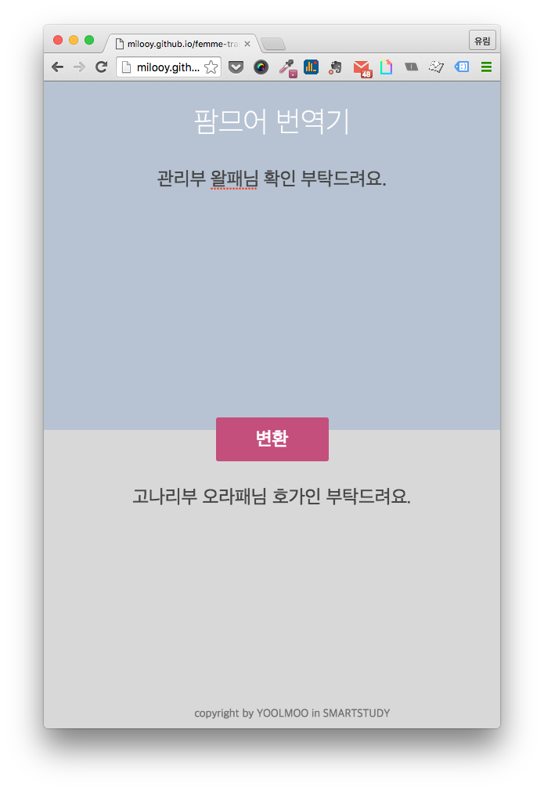
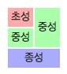

# femme-translator
당신의 언어를 팜므어로 번역해드립니다
<a href='http://milooy.github.io/femme-translator/'>사이트 링크</a>

이 문체는 <a href='http://www.smartstudy.co.kr/'>SMARTSTUDY</a>의 팜므님의 온라인상 어체이며, 이를 동경하는 자가 만든 번역기입니다.

문자가 이런 형태를 가지고 있을 때 중성 두 개를 분리해서 초성과 종성에 분배하는 것이 포인트로, 
굳이 머리속으로 계산하지 않아도, 쉽게 팜므어를 쓸 수 있게 도와줍니다.

한글 자음/모음 분리/조합은 <a href='https://github.com/e-/Hangul.js'>Hangul.js</a> 라이브러리를 사용하였습니다.
